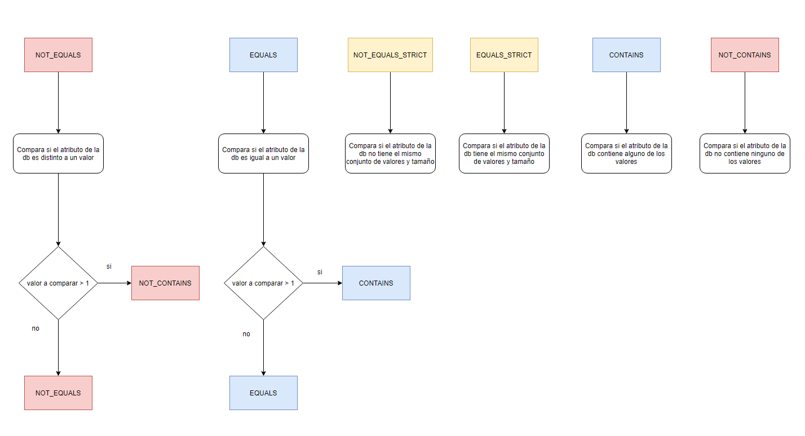
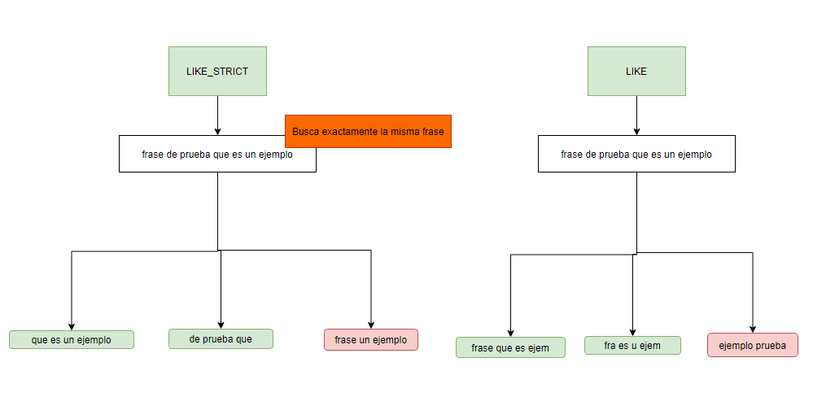

# SPRING COSMOSDB CRITERIA QUERIES

## Description
This library allows you to create criteria queries against CosmosDb , also all logic neccessary to launch this queries against the db are already developed, so it will help you to avoid think about how to create and launch those special queries against the db.
Remember that CosmosDb does not have developed this feature, as other db has, such as MongoDb for example.

---

## Operators
Bellow two images that represent how some operator work:




In order to check all operator available , you must check [**CriteriaOperator**](src/main/java/reactor/cosmosdb/criteria/domain/CriteriaOperator.java)

---

## How to create a criteria class
Now you can see some example about how to do it correctly. 
Imagine that you have this container on cosmosdb:

```java
@Data
public class Contact{
    private String userId;
    private String email;
    private String name;
    private String phoneNumber;
}
```

```java
@Container(containerName = "testing")
public class TestingContainer {
    private String id;
    private String code;
    private String state;
    private Contact contactOwner;
    private List<Contact> contactOwnerList; 
    }
```
| AtributeType                                  | conditionalToUse                                                        |
|-----------------------------------------------|-------------------------------------------------------------------------|
| <span style="color:#EE502E">**List**</span>   | <span style="color:#EE502E">super.conditionalCreatorAgainstArray</span> |
| <span style="color:#6027EC">**Object**</span> | <span style="color:#6027EC">super.conditionalCreator</span>             |

**Be carefull!** If you want to compare against a <span style="color:#EE502E">**List**</span> attribute of Container, you must use <span style="color:#EE502E">super.conditionalCreatorAgainstArray</span> 
```java
@Getter
@EqualsAndHashCode(onlyExplicitlyIncluded = true)
public class TestingCriteria implements PaginatedCriteria {
    @EqualsAndHashCode.Include
    private final String querySentence;

    public static class Builder extends AppCriteriaBuilder<TestingCriteria.Builder> {

        public static Builder builder(){
            return new Builder();
        }
        private Builder(){
            super();
        }

        public Builder id(CriteriaOperator criteriaType, List<String> id){
            this.addWhereCondition(super.conditionalCreator(criteriaType,"id",id));
            return this;
        }
        public Builder code(CriteriaOperator criteriaType, List<String> code){
            this.addWhereCondition(super.conditionalCreator(criteriaType,"code",code));
            return this;
        }
        public Builder state(CriteriaOperator criteriaType, List<String> state){
            this.addWhereCondition(super.conditionalCreator(criteriaType,"state",state));
            return this;
        }
        public Builder contactOwner(CriteriaOperator criteriaType, List<String> contactOwnerId){
            this.addWhereCondition(super.conditionalCreator(criteriaType,"contactOwner",contactOwnerId));
            return this;
        }
        public Builder contactOwnerListId(CriteriaOperator criteriaType, List<String> contactOwnerListId){
            this.addWhereCondition(super.conditionalCreatorAgainstArray(criteriaType,"contactOwnerList.id",contactOwnerListId));
            return this;
        }

        public Builder contactOwnerListName(CriteriaOperator criteriaType, List<String> contactOwnerListName){
            this.addWhereCondition(super.conditionalCreatorAgainstArray(criteriaType,"contactOwnerList.name",contactOwnerListName));
            return this;
        }
        

        public TestingCriteria build(){
            super.generateSqlSentence();
            return new TestingCriteria(this.getQuerySentence().toString());
        }
    }

    private TestingCriteria(String querySentence){
        this.querySentence = querySentence;
    }


}
```
---

## How to create a criteria query
Once you have created a criteria class, you are able to build a criteria query. Here , some examples that may help you to understand
You can create Testing classes on your project and run this tests, there you can play with criteria and check is behaviour.
It is important to remind you that you have two ways to create criterias:
- using default behaviour, all parenthesis **(** **)** , **and** **or** are managed by appCriteriaBuilder
- using ignoreAutoGeneratedFirstConditional, in this case you are responsible of concatenate all condition with desiderable operator, and also to close a parenthesis if you open it.

Do not worry if you malformed a query criteria , because it is controlled by AppCriteriaBuilder, so in case you did something wrong, it will throw an exception

```java
import CriteriaOperator;

import java.util.List;

public class PlayGround {
    @Test
    void testSimpleCriteria() {
        TestingCriteria criteria = TestingCriteria.Builder
                .builder()
                .code(CriteriaOperators.EQUALS, List.of("code1"))
                .state(CriteriaOperators.EQUALS, List.of("state1"))
                .build();
        System.out.println(criteria);
    }

    @Test
    void testSimpleCriteriaWithOrClause() {
        TestingCriteria criteria = TestingCriteria.Builder
                .builder()
                .code(CriteriaOperators.EQUALS, List.of("code1"))
                .or_start()
                .state(CriteriaOperators.EQUALS, List.of("state1"))
                .contactOwner(CriteriaOperator.EQUALS, List.of("contactOwnerId1"))
                .or_end()
                .build();
        System.out.println(criteria);
    }

    @Test
    void testingComplexCriteria() {
        TestinCriteria criteria = TestingCriteria.Builder
                .builder()
                .ignoreAutoGeneratedFirstConditional()
                .code(CriteriaOperators.EQUALS, List.of("code1"))
                .and()
                .state(CriteriaOperators.EQUALS, List.of("state1"))
                .and()
                .openParenthesis()
                .contactOwner(CriteriaOperator.EQUALS, List.of("contactOwnerId1"))
                .or()
                .contactOwner(CriteriaOperator.EQUALS, List.of("contactOwnerId2"))
                .closeParenthesis()
                .build();
        System.out.println(criteria);
    }
}

```

## How to launch criteria queries against cosmosDb

You need to extend from two classes ( [**ReactorOperationsCosmosDbRepository**](src/main/java/reactor/cosmosdb/criteria/application/ReactorOperationsCosmosDbRepository.java) and [**ReactorCosmosDbQueryLauncher**](src/main/java/reactor/cosmosdb/criteria/infraestructure/ReactorCosmosDbQueryLauncher.java) )

Examples:

```java
//E: entity (ej: Testing)
//C: container (ej: TestingContainer)
@Service
public class OperationsCosmosDbRepository<E,C> extends ReactorOperationsCosmosDbRepository<E,C> {
    private final CosmosDbQueryLauncher<C> queryLauncher;

    public OperationsCosmosDbRepository(CosmosDbQueryLauncher<C> queryLauncher){
        super(queryLauncher);
        this.queryLauncher= queryLauncher;
    }

}
```

```java
@Service
public class CosmosDbQueryLauncher<T> extends ReactorCosmosDbQueryLauncher<T> {
    @Value("${app.azure.cosmosdb.dbName}")
    public String databaseName;
    @Autowired
    public CosmosAsyncClient clientAsync;

    @Override
    public String getDatabaseName() {
        return this.databaseName;
    }
    public CosmosAsyncClient getClientAsync(){
        return this.clientAsync;
    }
}
```